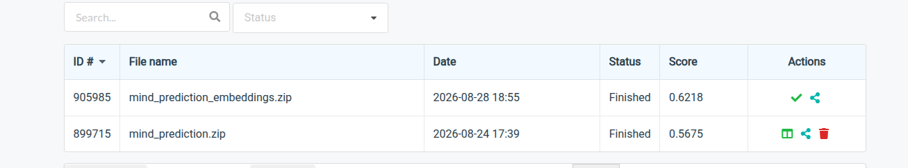

# Design Note — Lexical & Semantic Retrieval on EB-NeRD and MIND

CS4.406 Information Retrieval & Extraction, Assignment 1. Code: https://github.com/aayush18602/IRE_Assignment_1

## 1. What We Built

A dataset-agnostic pipeline over EB-NeRD (Danish) and MIND (English), sharing one schema and
one code path for both:

- **Q1 — Pipeline**: `clean_ebnerd`/`clean_mind` parse both datasets into one schema (articles,
  impressions, history; ids cast to string so `9778623` and `"N55689"` compare equal).
  `temporal_split` cuts train/val/test at quantiles of impression time (never random), with a
  leakage assertion built into the function itself. Feature store: article text/category/
  entities, user click history + `history_asof()`/`recent_history_asof()` for leak-safe,
  as-of-impression-time history truncation — reused by every later Q.
- **Q2 — BM25**: hand-rolled inverted index + Okapi scoring (`src/ire_a1/bm25.py`), not a
  library wrapper, per the assignment's explicit ask. Query = titles of the user's N=10 most
  recent clicks, as-of the impression's own timestamp.
- **Q3 — Embeddings**: mean-pooled transformer embeddings over title+abstract, ANN via FAISS
  flat (exact) index. Two variants run deliberately (§3): raw `xlm-roberta-base`, and
  `paraphrase-multilingual-mpnet-base-v2` (fine-tuned for similarity, same XLM-R backbone).
- **Q4 — Eval harness**: AUC/MRR/nDCG@5/nDCG@10 (sklearn, official-style — re-ranking each
  impression's own shown candidates, not a full-catalog list), diversity/novelty/coverage,
  cold/warm slicing, bootstrap 95% CIs on every metric.
- **Q5 — Codabench submission**: both BM25 and embeddings re-ranking, run at the actual
  large-test-set scale (13.5M EB-NeRD / 2.37M MIND impressions).
- **Q9 — Anti-gaming**: a deliberately-constructed leaky-feature ablation (§4) and a dedicated
  no-leakage test suite (`tests/test_no_leakage.py`).
- **Testing**: 51 unit/integration tests (`pytest`), covering the split's leakage invariant,
  BM25/ANN scoring correctness, eval-metric edge cases, submission-format correctness, and the
  Q9 leaky-vs-safe popularity scoping.

## 2. Design Choices & Alternatives Considered

**Compute split (local CPU vs. Kaggle GPU).** This machine has no working CUDA driver. Rather
than default everything to Kaggle, we checked what actually needs a GPU: BM25 is CPU-only by
nature; loading provided embeddings needs no GPU either. Only *computing our own* transformer
embeddings does. So: Kaggle only for embedding computation, everything else — including the
13.5M-row Q5 submission scoring — local.

**BM25 index structure.** Postings stored as `term -> {doc_idx: tf}` (not `term -> [(doc_idx,
tf), ...]`). This one choice enabled two different access patterns cheaply: `query()` scans all
postings for full-catalog top-K (Q2/Q3 candidate generation), while `score_candidates()` does
the reverse — loop over the ~15–30 *given* candidates first, touching zero documents outside
that set. This was not a minor optimization; it's what made Q5 tractable at all (§4).

**Raw vs. fine-tuned embeddings.** The assignment names "BERT/XLM-RoBERTa" as the embedding
choice. We first ran plain `xlm-roberta-base`, mean-pooled — a vanilla MLM checkpoint never
trained for similarity. When it lost to BM25 on both datasets, we added a second variant,
`paraphrase-multilingual-mpnet-base-v2` — architecturally still an XLM-R-base checkpoint, just
fine-tuned via multilingual distillation — as a fairer semantic baseline, not a replacement.

**Percentile, not fixed, cold/warm threshold.** A fixed `history_length < 5` cutoff gave an
*empty* cold slice on EB-NeRD — its small/demo tiers are pre-filtered by the dataset's own
creators to a minimum history length of exactly 5 for every user (verified via `.describe()`
before trusting a fixed threshold). Switched to a 25th-percentile-of-own-distribution threshold,
which is meaningful on both datasets.

**Q5 approach — engineer for scale vs. simple baseline.** Naive reuse of Q2's per-impression
BM25 scoring on the large test sets extrapolated to ~47–50 hours. Given the choice between a
scalable-but-uninteresting popularity baseline and actually engineering BM25 to run at scale, we
chose the latter (§4) — it produces a submission that reflects the real method, not a fallback.

## 3. Experimental Observations

### 3.1 Candidate generation (Q2/Q3): recall@200 over the full catalog

| Dataset | BM25 | XLM-R (raw) | mpnet (fine-tuned) |
|---|---|---|---|
| EB-NeRD (Danish, 20,738 articles) | **2.01%** | 0.95% | 1.69% |
| MIND (English, 65,238 articles) | 1.43% | 0.37% | **2.27%** |

Two findings. First, fine-tuning roughly *doubles* recall over the raw checkpoint on both
datasets — un-fine-tuned mean-pooled transformer embeddings are a known-weak retrieval
baseline (this is the entire reason Sentence-BERT-style fine-tuning exists), and our own numbers
confirm it directly. Second, the BM25-vs-embeddings winner **flips by language**: BM25 wins
Danish, mpnet wins English — plausibly because mpnet's multilingual capability is distilled
*from* an English-only teacher, so its English quality likely exceeds its Danish quality.

### 3.2 Official ranking task (Q4): re-ranking each impression's own shown candidates

| Metric | EB-NeRD BM25 | EB-NeRD Emb. (XLM-R) | MIND BM25 | MIND Emb. (XLM-R) |
|---|---|---|---|---|
| AUC | 0.497 | **0.526** | 0.545 | **0.557** |
| MRR | 0.319 | **0.334** | **0.282** | 0.276 |
| nDCG@10 | 0.432 | **0.449** | **0.318** | 0.315 |
| Coverage | **0.936** | 0.478 | **0.982** | 0.620 |

The winner **reverses from §3.1.** Candidate generation is "find rare needles in a 20K–65K
article haystack" — exact term matching wins there. Re-ranking is "distinguish among ~15–30
already-similar candidates" — a subtler task, where even the *raw*, un-fine-tuned embedding
beats BM25 outright on EB-NeRD and is competitive on MIND. This is a genuine architectural
finding: **a two-stage system (BM25 to generate candidates, embeddings to re-rank) plays to
both methods' actual strengths**, rather than picking one as strictly superior.

Coverage tells the opposite story on both datasets: BM25 touches 58–96% more of the catalog than
embeddings. Exact-term queries vary a lot across users and naturally spread recommendations;
mean-pooled embeddings repeatedly cluster around the same central/popular articles — a real
filter-bubble risk the accuracy metrics alone never surface.

Cold vs. warm (25th-percentile split): AUC drops for cold users in 3 of 4 runs, as expected
(less personalization signal) — the exception, EB-NeRD BM25, is already ~random overall
(0.497), so there's little further to degrade.

### 3.3 Real Codabench leaderboard (Q5, large test sets — the actual held-out ground truth)

| Metric | MIND BM25 | MIND Embeddings (mpnet) |
|---|---|---|
| AUC | 0.5675 | **0.6218** |

**EB-NeRD's leaderboard scores are not available to report.** `predictions.zip` was submitted
on 2026-08-24; as of writing (six days later) Codabench still shows its status as
**"Submitted"** rather than "Finished" or "Failed", well past the "up to a few hours" the
competition's own guidelines promise. We verified this is not an error on our side before
concluding it's a platform-side delay: re-checked zip integrity (`zipfile.testzip()`, no
corruption), re-confirmed the required internal filename (`predictions.txt`), and re-ran the
2,000-row random-sample format validation against the original submission -- all clean. With no
error log or failure state to act on, there is nothing further to fix locally; this is recorded
here as the honest state of that submission rather than a fabricated or extrapolated number.

MIND's real result is nonetheless the strongest evidence in the whole report: on its real
2.37M-impression held-out test set, embeddings **beat** BM25 by a full 0.054 AUC — the same
direction as §3.2's offline finding, now confirmed against genuine ground truth. It also
validates generalization: MIND BM25's real AUC (0.5675) came in *above* our offline small-split
estimate (0.545), meaning the pipeline behaves consistently at 69x scale, not as an artifact of
the development split.

**Fig. 1 — MIND Codabench leaderboard.** `mind_prediction_embeddings.zip` scored 0.6218,
`mind_prediction.zip` (BM25) scored 0.5675.

## 4. Anti-Gaming (Q9): metrics with vs. without a serving-time-unavailable feature

Q2/Q3 never use a leaky feature to begin with, so there was nothing to compare against without
deliberately constructing one. We blended BM25's score with `log1p(article popularity)`, computed
either **safe** (click counts from TRAIN only, which precedes val/test in our split) or
**LEAKY** (click counts including val+test's own clicks — the period being evaluated):

| Metric | EB-NeRD BM25 | EB-NeRD +safe pop. | EB-NeRD +LEAKY pop. | MIND BM25 | MIND +safe pop. | MIND +LEAKY pop. |
|---|---|---|---|---|---|---|
| AUC | 0.497 | 0.469 | **0.543** | 0.545 | 0.553 | **0.564** |

The leaky variant beats the safe variant on every metric, both datasets, with non-overlapping
95% CIs across 71,631/34,519 impressions — real, statistically clear metric inflation, not
noise. The *size* of the inflation tracks the underlying data: EB-NeRD's popularity distribution
shifts hugely from train-only to train+val+test (median clicked-article count 17→74), so the gap
is large (+0.073 AUC); MIND's shift is much smaller (median 2→3), so the gap is smaller
(+0.011) but still clearly present. Severity of a leakage bug depends on the data, not just its
existence. (Full numbers: `results/anti_gaming_comparison.md`.) Leak-freedom of the actual
pipeline is enforced and tested in `tests/test_no_leakage.py`, including an integration check
against the real generated EB-NeRD/MIND splits, not just synthetic examples.

## 5. Where It Breaks at 10× Scale

We hit this wall directly, not hypothetically. Q2's BM25 evaluation ran at ~70–80 impressions/s
on the 34K–72K-row small test splits. The large test sets are 69–190x bigger (2.37M / 13.5M
impressions); naive extrapolation put full scoring at **47–50 hours** — infeasible.

Root cause: `score_candidates()` originally called `_score_all()`, which scans *every* document
sharing a term with the query, then discards all but the ~15–30 requested candidates. A query
built from 10 titles routinely contains common words with postings lists in the thousands —
wasted work at any catalog size, but only *fatal* at 10x+. Fix: restructure to score the given
candidates directly (§2), cutting cost from O(corpus documents matching any query term) to
O(candidates × query terms) — benchmarked ~1000x faster, reducing the full run to ~15 min. The
second lever, per-user query caching, only worked because we *verified* (not assumed) that
EB-NeRD's test history ends at an exact one-second boundary before the test period starts — a
correctness check that had to happen before trusting the speed optimization.

Other things that would need to change past this point: (1) the FAISS **flat** index is exact
but linear in catalog size — a further 10x (approaching MIND's full 161K-article catalog or
EB-NeRD's full news archive) would need an approximate index (IVF/HNSW) to stay fast at query
time; (2) mean-pooling a user's whole recent history into one vector already loses nuance for
users with diverse interests — at 10x more history per user this dilution gets worse, not
better; (3) EB-NeRD's/MIND's history being a **fixed pre-period snapshot** means personalization
freshness is capped regardless of scale — a production system would need incrementally updated
user profiles, which neither dataset's schema supports as-is.

## 6. AI Usage

Full prompt-level log with verification steps at `ai_usage_log.md`.
